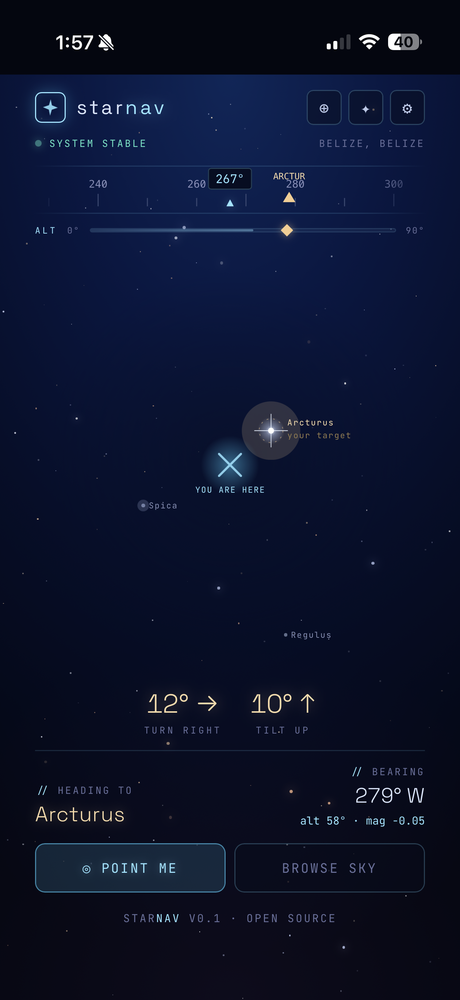
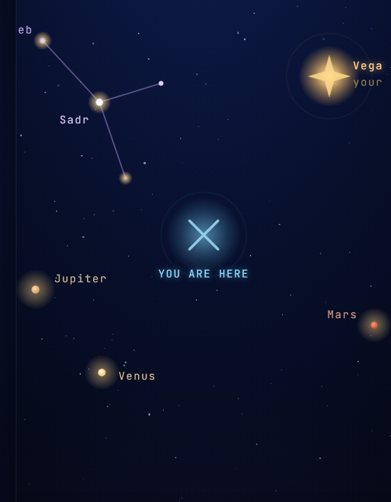

# starnav

A night-sky navigator. The **space** axis of codereimagine.

Live: [codereimagine.github.io/starnav](https://codereimagine.github.io/starnav/)

By **Bert Peters**.

## Screenshots

<table>
  <tr>
    <th>Mobile</th>
    <th>Desktop</th>
  </tr>
  <tr>
    <td></td>
    <td></td>
  </tr>
  <tr>
    <td colspan="2"><sub>Point your device at the sky; starnav tells you what you're looking at. Sun, moon, planets, constellations — all computed in-browser.</sub></td>
  </tr>
</table>

## What it does

- **Point-me**: device-orientation aware. Aim your phone at the sky and starnav identifies what's overhead, with turn / tilt directions to the next target.
- **Arc-min engine**: precise positions for sun, moon, planets, and constellations — computed from your coordinates, locally.
- **Dual search**: find places + find objects in one bar.
- **Target picker**: pick a celestial object as your target; starnav guides you to it with bearing + altitude deltas.
- **Themed settings**: light / dark / sky-matched theme; font and animation controls.
- **Atmospheric starfield** behind the navigator UI.
- **Installable PWA.** Works offline once cached.
- **Local-first by lock.** Zero runtime network for the sky math. The only network call in the entire app is the geocoding search you explicitly trigger.

## Data sources

- **Planet positions**: VSOP-style Keplerian elements (Mercury through Neptune) in `src/engine/planets.ts`, computed locally per JPL low-precision standard. **No network.**
- **Star catalog**: bright-star data baked into `src/engine/stars.ts`. **No network.**
- **Constellation lines**: bundled in the engine. **No network.**
- **Sun + sidereal time**: NOAA / Meeus formulas in `src/engine/altaz.ts`. **No network.**
- **Device orientation**: `DeviceOrientationEvent` (iOS asks permission first). Local browser API.
- **City search (explicit, user-triggered only)**: [Open-Meteo geocoding](https://open-meteo.com/en/docs/geocoding-api) (keyless), used by `src/engine/observer.ts` when the user types in the city search.

## Stack

React 19 · Vite · TypeScript · Space Grotesk · JetBrains Mono · vite-plugin-pwa · Vitest.

## Develop

```sh
npm install
npm run dev       # http://localhost:5173
npm run build     # tsc --noEmit && vite build
npm run preview   # serves the production bundle on :4280
npm run test
```

## Project layout

```
src/
  engine/
    altaz.ts          # alt/az from RA/Dec + observer + time (NOAA / Meeus)
    observer.ts       # observer location + city search (Open-Meteo)
    planets.ts        # Keplerian planet positions
    stars.ts          # bright-star catalog
    tick.ts           # animation pulse
    engine.test.ts    # verification
  sky/
    pointme.ts        # device-orientation → camera target math
    projection.ts     # sky → screen
    format.ts         # display formatting
  hooks/
    useFitScale.ts    # scale-to-fit
    useVisualViewport.ts
  lib/
    PwaUpdate.tsx     # registerSW wrapper
  components/
    UpdateBanner.tsx  # SW update prompt
  store/
    settings.ts       # zustand store (persisted)
  App.tsx
  CitySearch.tsx      # city search panel
  TargetPicker.tsx    # celestial target picker
  Settings.tsx        # settings UI
  main.tsx
public/                # PWA manifest + icons
docs/
  screenshots/        # README images
```

## Related

starnav is one of three axes of codereimagine:

- **[bewthr](https://github.com/codereimagine/bewthr)** — continuum (weather)
- **[uptyme](https://github.com/codereimagine/uptyme)** — time
- **starnav** — space

## License

Apache License 2.0 — see [LICENSE](./LICENSE).
