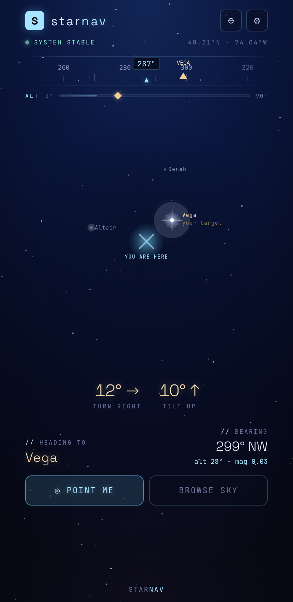
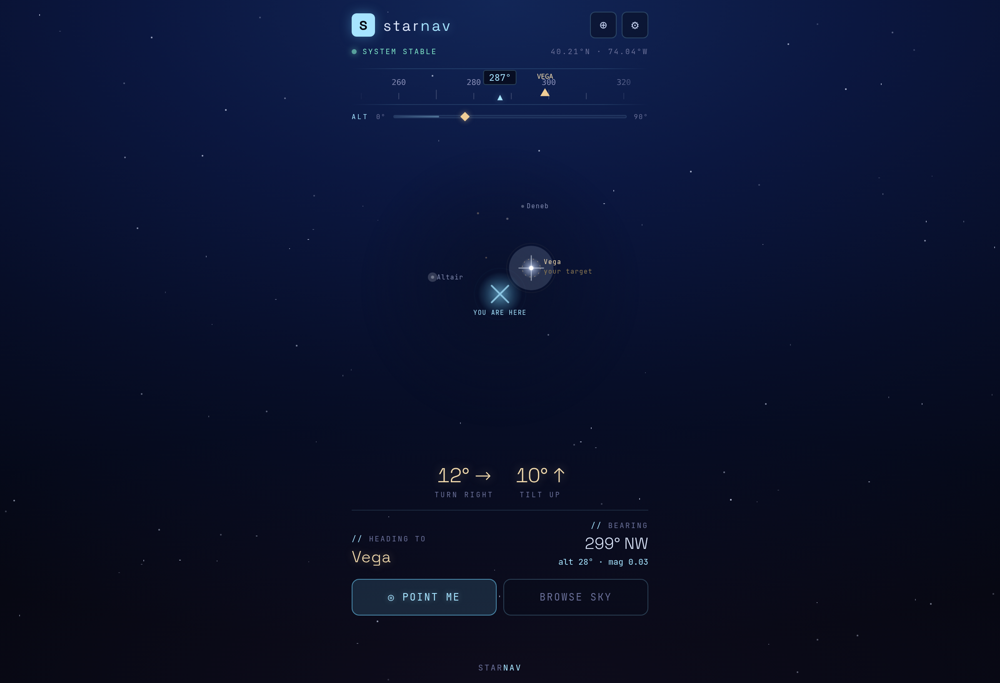

<div align="center">

# starnav

### A night-sky navigator — point your device at the sky and starnav tells you what you're looking at.

*No accounts, no trackers, no ads — private by design.*

**▶ Live — [codereimagine.github.io/starnav](https://codereimagine.github.io/starnav/)**

<p>
  
  
</p>

<sub>Aim your phone at the sky — starnav identifies sun, moon, planets and constellations, all computed in-browser.</sub>

**By Bert Peters** · the **space** axis of [codereimagine](https://github.com/codereimagine).

</div>

---

Aim your device at the sky and starnav identifies what's overhead — sun, moon, planets, constellations — with turn/tilt directions to your next target, all computed on-device.

## What it does

- **Point-me.** Device-orientation aware — aim your phone at the sky and starnav identifies what's overhead, with turn/tilt directions to the next target.
- **Arc-minute engine.** Precise positions for sun, moon, planets and constellations, computed from your coordinates locally.
- **Dual search.** Find places *and* find objects in one bar.
- **Target picker.** Pick a celestial object; starnav guides you to it with bearing + altitude deltas.
- **Themed.** Light / dark / sky-matched theme, with font and animation controls.
- **Installable PWA.** Works offline once cached.
- **Private by design — no accounts, no trackers, no ads.** Zero runtime network for the sky math; the only outbound call in the whole app is the city search you explicitly trigger. Nothing about you leaves your device.

## How it computes — all local, no network

- **Planet positions** — VSOP-style Keplerian elements (Mercury–Neptune), JPL low-precision standard, in `src/engine/planets.ts`.
- **Stars & constellations** — a bright-star catalog + constellation lines baked into the engine (`src/engine/stars.ts`).
- **Sun & sidereal time** — NOAA / Meeus formulas in `src/engine/altaz.ts`.
- **Device orientation** — `DeviceOrientationEvent` (iOS asks permission first), a local browser API.
- **City search (only when you type it)** — [Open-Meteo geocoding](https://open-meteo.com/en/docs/geocoding-api), keyless — the one outbound fetch in the app.

## Tech

React 19 · Vite · TypeScript · Space Grotesk + JetBrains Mono · `vite-plugin-pwa` · Vitest. A PWA — installable and offline-capable.

## Run it locally

```sh
npm install
npm run dev       # http://localhost:5173
npm run build     # tsc --noEmit && vite build
npm run preview   # serves the production bundle on :4280
npm run test      # Vitest
```

## The codereimagine trilogy

starnav is one of three axes of [codereimagine](https://github.com/codereimagine):

- **[bewthr](https://github.com/codereimagine/bewthr)** — continuum (weather)
- **[uptyme](https://github.com/codereimagine/uptyme)** — time
- **starnav** — space

## License

Apache-2.0.
